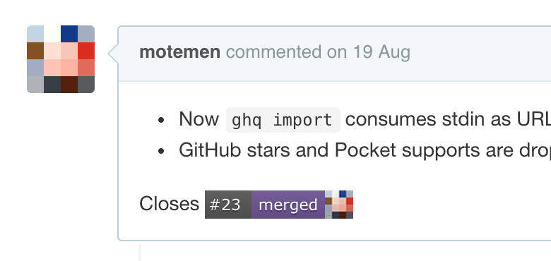

# GitHub Issue Badges

Chrome extension to change issue links into badges.

## How to build

    npm install
    npm run build
    
## Store links

- [GitHub Issue Badges](https://chrome.google.com/webstore/detail/github-issue-badges/mkfiamgphibplgocbkifgcpnioogccfm)
- [GitHub Issue Badges (for Enterprise)](https://chrome.google.com/webstore/detail/github-issue-badges-for-e/bnbbodldimbdcckbnplohombkipjnmni)
